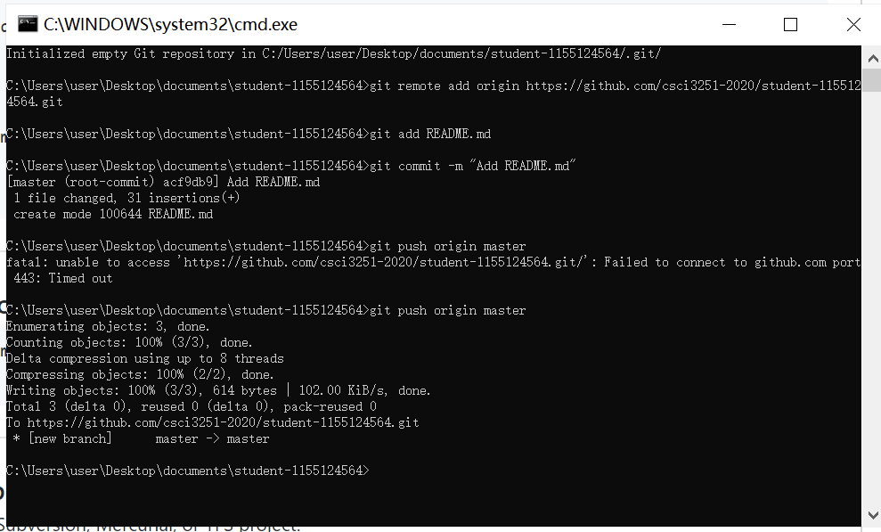

# About Me

I am  **Ji Yi**. A student in CS, currently in Y2.

# Programming Skills

* C/~~C++~~(Maybe?)
* Java
* Javascript

# Some Courses I am taking this term

| Couse Code  | Couse Title |
| :----: | :----: |
| CSCI 2720 | Building Web Applications | 
| CSCI 3250 | Computers and Society | 
| CSCI 3251 | Engineering Practicum |
| Estr 2102 | Data structure |
| Estr 2002 | Probability(I am  too lazy to check its title) |

# Things I want to accomplish:

* [ ] Sleep early
* [ ] Assignment 4 of 2720
* [X] Programming 5 0f 2102
* [X] Assignment 5 of 2002 
* [ ] Blog of 3250

# Screen Shot

